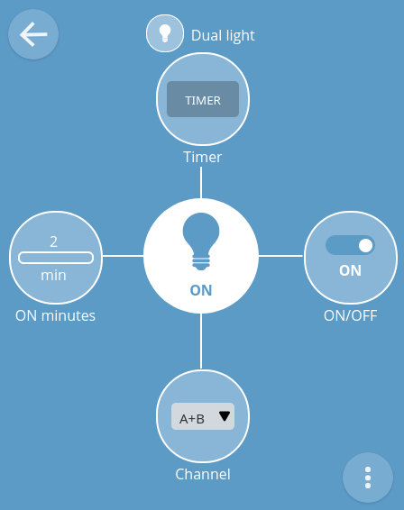
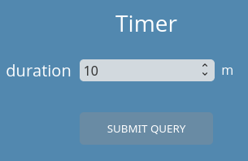

# webThing Dual Light

## Introduction

WebThing Dual Light is prepared for ESP32 CPUs and uses esp-idf environment (current stable version: 4.1).

This software controls two channels via the WebThing API interface. In the ```prototype``` folder see implementation with 2 relays for 2 devices powered by 230 VAC with a maximum power of 300 W each.

## Dependencies

Requires:

 * [web-thing-server](https://github.com/KrzysztofZurek1973/webthings-components/tree/master/web_thing_server) from ```webthings-components```

## Example

See [webthings-node-example-project](https://github.com/KrzysztofZurek1973/webthings-node-example-project)

## Features



This webThing has the following properties and one action:

 * ON/OFF
 * Channel, choose channel A, B or A+B
 * ON minutes, shows minutes when device was ON in the current day, it is cleared on midnight
 * Timer (action), turn ON the heater for a certain number of minutes
 
 

## Documentation

See [webthings-empty-project](https://github.com/KrzysztofZurek1973/webthings-empty-project) and follow steps described in **Build webThing Device** chapter.

In point 5 download ```webthing-dual-light``` repository. In function ```init_things()``` call ```init_dual_light()``` and include ```webthing_dual_light.h``` in your main project file.

## Source Code

The source is available from [GitHub](https://github.com/KrzysztofZurek1973).

## Prototype

In the ```prototype``` folder there are schematic files, gerber files and a photo of the working prototype device. This device is built with ESP32 DevKitC.

## Links

* [WebThing Gateway](https://webthings.io/gateway/) - https://webthings.io/gateway/
* [Web Thing API](https://webthings.io/api/) - https://webthings.io/api/
* [esp-idf](https://github.com/espressif/esp-idf) - https://github.com/espressif/esp-idf

## License

This project is licensed under the MIT License.

## Authors

* **Krzysztof Zurek** - [github](https://github.com/KrzysztofZurek1973)


